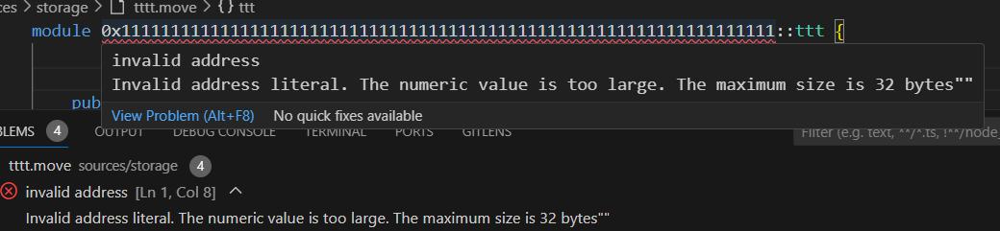
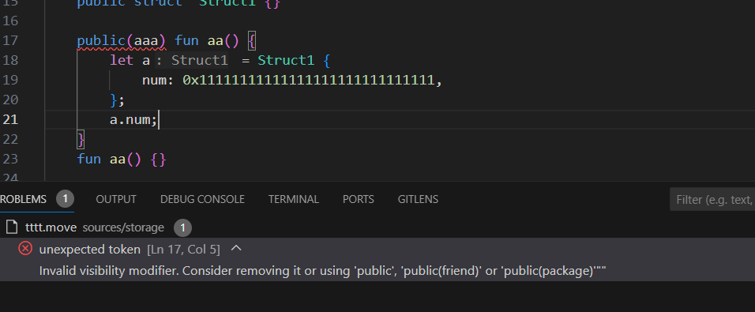
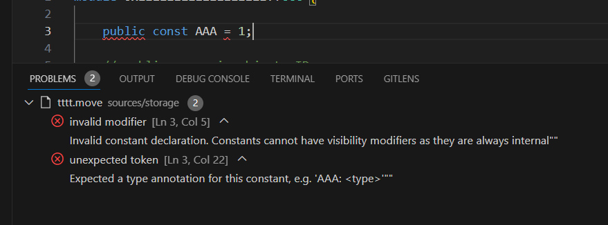
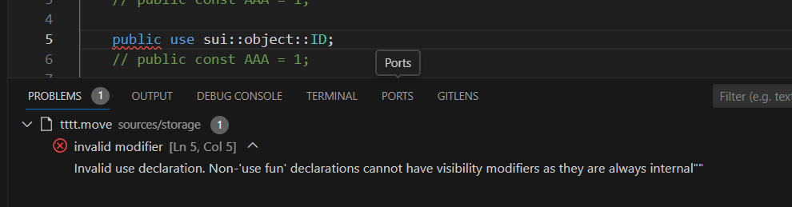
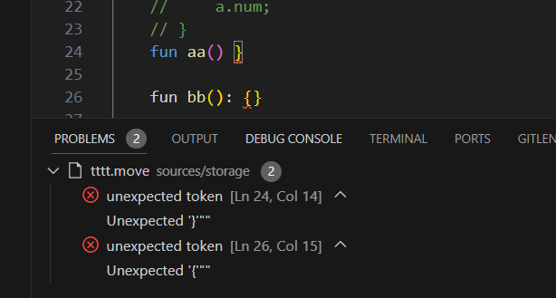

# sui-move-analyzer.server v1.1.8

## 1. New feature
  Added diagnostic hints and diagnostic information based on lexical and syntax analysis for single file.
  - Invalid address.
  - Invalid struct declaration.
  - Invalid visibility modifier. 
  - Invalid constant declaration.
  - Invalid use declaration.
  - Duplicate ability declaration.
  - Unexpected token

### 1.1 Invalid address


### 1.2 Invalid struct declaration


### 1.3 Invalid visibility modifier


### 1.4 Invalid constant declaration


### 1.5 Invalid se declaration


### 1.6 Unexpected token


# sui-move-analyzer.server v1.1.9
upgrade dependence of MystenLabs/sui

# sui-move-analyzer.server v1.2.0
support method syntax in [move2024] 

example:
```move
clock.timestamp_ms()
```

# sui-move-analyzer.server v1.5.0
1.New feat: showStructDependencyGraph

1.Improve: not load redundant dependencies that are duplicated, greatly improving speed

3.Fix bug #16: failed goto on stdlib when implicit dep absent

4.Fix bug #17: can't find definition like a::b::fun_name()

5.New feat: support new syntax `use fun`

6.New feat: support use alias

7.New feat: support macro fun

8.Fix bug: analyzer to lambda exp

